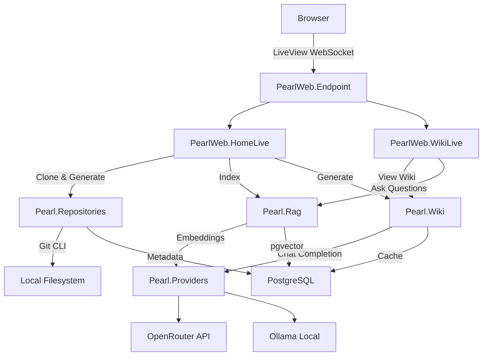

# Architecture

Pearl is a Phoenix/Elixir application organized around four core contexts,
following the Phoenix conventions for bounded contexts.

## System Overview

## Core Contexts

### Pearl.Repositories

Manages git repository cloning and file analysis. Key modules:

- `Pearl.Repositories` — Context API for cloning, metadata fetching, and file operations
- `Pearl.Repositories.RepoRecord` — Ecto schema storing repository metadata and status
- `Pearl.Repositories.Git` — Git CLI wrapper for clone, list-files, and URL parsing

### Pearl.Wiki

Orchestrates wiki generation from repository code via LLM. Key modules:

- `Pearl.Wiki` — Context API for generation and cache management
- `Pearl.Wiki.Generator` — Multi-page wiki generation pipeline
- `Pearl.Wiki.Prompts` — LLM prompt templates for structure analysis and page writing
- `Pearl.Wiki.WikiCache` — Ecto schema caching generated wiki content

### Pearl.Rag

Handles the retrieval-augmented generation pipeline. Key modules:

- `Pearl.Rag` — Context API for indexing, search, and Q&A
- `Pearl.Rag.Chunker` — Splits code files into embeddable chunks
- `Pearl.Rag.Embedding` — Ecto schema with pgvector for similarity search

### Pearl.Providers

Abstracts LLM provider interactions behind a common behaviour. Key modules:

- `Pearl.Providers` — Facade routing calls to the active provider
- `Pearl.Providers.Provider` — Behaviour defining the provider interface
- `Pearl.Providers.Ollama` — Local Ollama integration
- `Pearl.Providers.OpenRouter` — Cloud OpenRouter API client

## Web Layer

The web layer uses Phoenix LiveView for real-time UI without custom JavaScript:

- `PearlWeb.HomeLive` — Repository list, clone form, and wiki generation triggers
- `PearlWeb.WikiLive` — Wiki page viewer with sidebar navigation and RAG chat panel
- `PearlWeb.MarkdownComponent` — Markdown rendering with Mermaid diagram support

## Database

PostgreSQL with the pgvector extension provides both relational storage and
vector similarity search:

| Table | Purpose |
|-------|---------|
| `repos` | Repository metadata, status, and provider info |
| `wiki_caches` | Generated wiki structure and page content |
| `embeddings` | Vector embeddings with HNSW index for cosine similarity |
