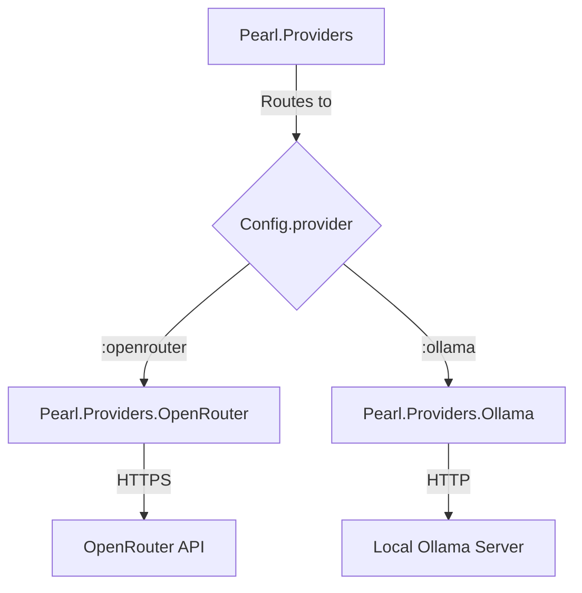

# LLM Providers

Pearl supports multiple LLM providers through the `Pearl.Providers.Provider`
behaviour. This guide covers configuration and usage.

## Provider Architecture



The `Pearl.Providers` module acts as a facade, routing all calls to
the provider configured via `Pearl.Config.provider/0`.

## Configuration

Set these environment variables before starting Pearl:

### OpenRouter (Cloud)

```bash
export LLM_PROVIDER=openrouter
export LLM_MODEL=openai/gpt-5.2
export EMBEDDING_MODEL=openai/text-embedding-3-small
export OPENROUTER_API_KEY=sk-your-key-here
```

### Ollama (Local)

```bash
export LLM_PROVIDER=ollama
export OLLAMA_HOST=http://localhost:11434
export OLLAMA_DEFAULT_MODEL=llama3.2:3b
```

Ollama requires v0.3.3+ for the `/api/embed` endpoint used by Pearl.

## Provider Behaviour

All providers implement `Pearl.Providers.Provider` which defines three callbacks:

- `chat/3` — Send messages and receive a completion (sync or streamed)
- `embed/1` — Generate vector embeddings for a list of texts
- `list_models/0` — List available models from the provider

## Adding a New Provider

1. Create a module implementing `Pearl.Providers.Provider`
2. Add a clause to `Pearl.Providers` to route to your new module
3. Add configuration handling in `Pearl.Config`
