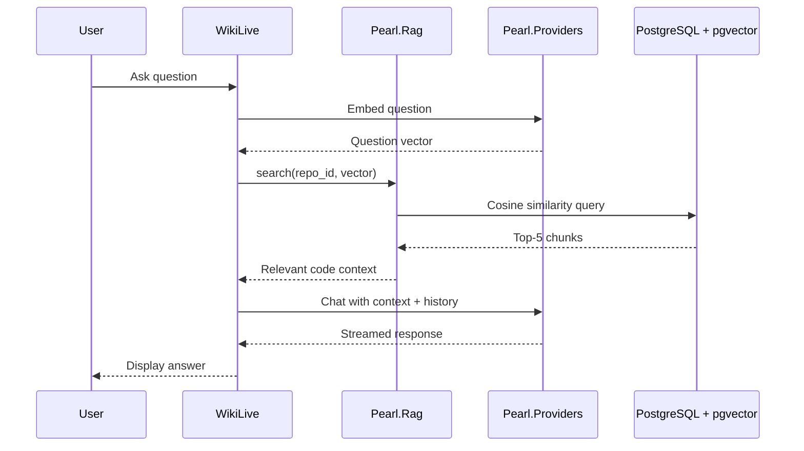

# RAG Pipeline

Pearl uses Retrieval-Augmented Generation (RAG) to answer questions about
code repositories. This guide explains how the pipeline works.

## Overview

## Indexing Phase

When a repository is cloned, Pearl indexes it for RAG:

1. **File listing** — `Pearl.Repositories.Git.list_files/1` returns tracked code files
2. **Parallel reading** — Files are read concurrently via `Task.async_stream`
3. **Chunking** — `Pearl.Rag.Chunker` splits files into ~500-token chunks with
   semantic break detection at paragraph boundaries
4. **Batch embedding** — Chunks are batched and sent to the configured embedding
   model (default: `text-embedding-3-small` at 1536 dimensions)
5. **Storage** — Embeddings are stored in the `embeddings` table with an HNSW index

Configuration options in `Pearl.Config`:
- `embedding_batch_size/0` — Chunks per API call (default: 100)
- `file_read_concurrency/0` — Parallel file reads (default: 10)

## Query Phase

When a user asks a question:

1. **Embed question** — The question text is embedded using the same model
2. **Similarity search** — pgvector finds the top-5 nearest chunks by cosine distance
3. **Context assembly** — Retrieved chunks are formatted with file paths
4. **LLM response** — The context and conversation history are sent to the chat model
5. **Streaming** — The response is streamed token-by-token to the LiveView

## Current Implementation: Naive RAG

Pearl currently uses the simplest RAG architecture:

| Component | Implementation |
|-----------|----------------|
| Chunking | Fixed 500-token chunks with paragraph boundary detection |
| Embedding | OpenAI `text-embedding-3-small` (1536 dims) or Ollama `nomic-embed-text` |
| Vector Store | PostgreSQL + pgvector with HNSW indexing |
| Retrieval | Top-5 by cosine similarity |
| Generation | Context concatenated into system prompt |

## Limitations

- No chunk overlap — context can be lost at boundaries
- Fixed-size chunking ignores code semantics (functions, classes)
- Top-k retrieval may miss relevant but lexically dissimilar chunks
- No re-ranking stage to filter low-quality matches
